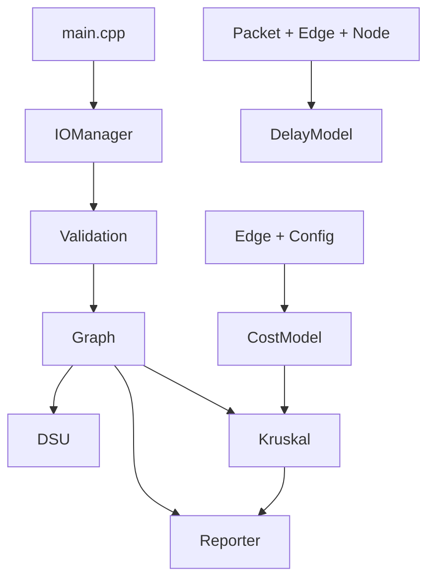

# TỔNG HỢP TOÀN BỘ DỰ ÁN PBL2 THEO CODE THỰC TẾ

> Tài liệu này được lập từ trạng thái thực tế của nhánh hiện tại ngày 2026-09-22. Phạm vi gồm toàn bộ thư mục và file đang có trong workspace, không chỉ phần của một thành viên. Các đoạn mã C++ bên dưới được chép theo code hiện tại; phần giải thích bám vào hành vi thật của chương trình, không suy diễn theo task board.

## 1. Phạm vi và kết luận nhanh

Dự án hiện là một chương trình C++17 mô phỏng giai đoạn chuẩn bị hạ tầng mạng. Luồng đã có thật gồm:

```text
File nodes.txt / edges.txt / packets.txt
        |
        v
IOManager đọc và chuyển text thành Node, Edge, Packet
        |
        v
Validation loại dữ liệu sai
        |
        v
Graph lưu topology và adjacency
        |
        +--> CostModel tính chi phí cáp
        +--> DSU + Kruskal xây MST có giới hạn cổng
        +--> chọn tối đa k link dự phòng
        +--> DelayModel tính độ trễ trên một edge
        +--> Reporter in bảng chi phí
```

Phần đã triển khai và có test tốt: Graph, DSU, Kruskal, backup, Validation, IO, CostModel, DelayModel. Phần chưa được nối vào luồng chạy chính: `Dijkstra`, routing end-to-end, simulator, scenario, event processing, QoS, reliability và cập nhật load động. Các module đó cũng chưa tồn tại trong cây file hiện tại, dù xuất hiện trong tài liệu kế hoạch cũ.

## 2. Cấu trúc thư mục thực tế

```text
Project_PBL2/
├── .gitattributes
├── .gitignore
├── .vscode/
│   ├── cpp_properties.json
│   ├── launch.json
│   ├── settings.json
│   └── tasks.json
├── bin/
│   ├── main.exe
│   ├── test_cost.exe
│   └── checks/                 # file sinh ra khi chạy kiểm tra lần này
├── data/
│   ├── nodes.txt
│   ├── edges.txt
│   └── packets.txt
├── docs/
│   ├── giai_thich_tuan_1.md
│   ├── giai_thich_tuan_2.md
│   ├── giai_thich_tuan_3.md
│   ├── PBL2_Quy_Trinh_Chi_Tiet.docx
│   ├── Tong_Hop_Toan_Bo_Code.md
│   └── Tong_Hop_Toan Bo_Du An_Thuc Te.md  # file này
├── include/
│   ├── Config.h
│   ├── CostModel.h
│   ├── DelayModel.h
│   ├── DSU.h
│   ├── Edge.h
│   ├── Graph.h
│   ├── IOManager.h
│   ├── Kruskal.h
│   ├── Node.h
│   ├── Packet.h
│   ├── Reporter.h
│   ├── Types.h
│   └── Validation.h
├── src/
│   ├── CostModel.cpp
│   ├── DelayModel.cpp
│   ├── DSU.cpp
│   ├── Graph.cpp
│   ├── IOManager.cpp
│   ├── Kruskal.cpp
│   ├── Reporter.cpp
│   └── Validation.cpp
├── tests/
│   ├── test_b2_3.cpp
│   ├── test_cost.cpp
│   ├── test_delay.cpp
│   ├── test_graph_kruskal.cpp
│   ├── test_invalid_data.cpp
│   ├── test_reporter.cpp
│   ├── test_validation.cpp
│   └── data/invalid/
└── main.cpp
```

`bin/*.exe` là file nhị phân đã biên dịch, không phải mã nguồn nên không thể chép thành code có ý nghĩa. `docs/PBL2_Quy_Trinh_Chi_Tiet.docx` là tài liệu nhị phân Word; tài liệu này ghi nhận vai trò của nó nhưng không tái tạo byte nội bộ.

---

# 3. Các file ở thư mục gốc

## 3.1. `main.cpp`

### Chức năng và đóng góp

Đây là entry point của chương trình. File tạo `Graph`, gọi `IOManager` để nạp ba bộ dữ liệu, in số lượng record đọc thành công rồi kết thúc. Nó cần thiết để biến các module thư viện thành chương trình chạy được.

Điểm quan trọng: bản hiện tại **chưa gọi** `buildMST`, `selectBackupLinks`, `DelayModel` hoặc `Reporter`; vì vậy chạy executable chính mới kiểm tra được pipeline đọc dữ liệu, chưa mô phỏng toàn bộ bài toán.

### Mã nguồn hiện tại

```cpp
#include <iostream>
#include <vector>
#include "Graph.h"
#include "IOManager.h"

int main() {
    std::cout << "=== KHOI TAO DO THI PBL2 ===\n";
    Graph graph;
    
    std::cout << "\n--- Load Nodes ---\n";
    if (IOManager::loadNodes("data/nodes.txt", graph)) {
        std::cout << "=> So luong node hien tai: " << graph.V() << "\n";
    }
    
    std::cout << "\n--- Load Edges ---\n";
    if (IOManager::loadEdges("data/edges.txt", graph)) {
        std::cout << "=> So luong edge hien tai: " << graph.E() << "\n";
    }
    
    std::cout << "\n--- Load Packets ---\n";
    std::vector<Packet> packets;
    if (IOManager::loadPackets("data/packets.txt", packets)) {
        std::cout << "=> So luong packet load thanh cong: " << packets.size() << "\n";
    }

    std::cout << "\n=== KET THUC KHOI TAO ===\n";
    return 0;
}
```

### Giải thích từng khối

- Hai `#include` chuẩn cung cấp stream console và vector packet.
- `Graph.h` cung cấp cấu trúc topology; `IOManager.h` cung cấp các hàm đọc file.
- `main()` là hàm bắt đầu của C++.
- `Graph graph;` tạo đồ thị rỗng.
- Mỗi lời gọi `load...` nhận đường dẫn tương đối từ thư mục chạy là root project.
- Điều kiện `if` chỉ in số lượng khi mở file thành công; các dòng sai trong file bị reject bên trong loader nhưng loader vẫn trả `true` nếu file mở được.
- `packets` là vector độc lập vì Packet chưa được lưu trong Graph.
- `return 0` báo chương trình kết thúc bình thường.

## 3.2. `README.md`

README mô tả mục tiêu PBL2, cấu trúc dự án và kế hoạch theo tuần. Nó còn liệt kê nhiều module dự kiến như `Dijkstra`, `Reliability`, `Simulator`, `Scenario`, nhưng các file tương ứng không tồn tại trong cây hiện tại. Do đó README nên được xem là tài liệu định hướng, không phải danh sách chức năng đã hoàn thành.

## 3.3. `PBL2_Task_Board_Chi_Tiet_6Tuan_A_B.md`

Đây là task board sáu tuần, phân công hai thành viên, data contract, công thức và checkpoint. Nó mô tả mục tiêu lớn hơn code hiện tại: sau Kruskal phải có Dijkstra, mô phỏng truyền packet, sự kiện link/load/delay và báo cáo. Các checkbox trong tài liệu cần được đối chiếu với test và source; không nên dùng riêng task board để kết luận đã hoàn thành.

## 3.4. `.gitattributes` và `.gitignore`

`.gitattributes` quy định thuộc tính file khi Git xử lý repository. `.gitignore` quy định các file/thư mục không đưa vào version control, thường gồm binary, build output hoặc file môi trường. Hai file này phục vụ quản lý repository, không tham gia runtime.

---

# 4. Thư mục `.vscode/`

## 4.1. `tasks.json`

Khai báo task build mặc định `Build PBL2 Project`, dùng `g++`, gom `src/*.cpp` cùng `main.cpp`, thêm include path và xuất `bin/main.exe`. Đây là cách build nhanh từ VS Code. Task đã được kiểm tra tương đương bằng lệnh C++17 thủ công.

Một chi tiết cần biết: glob `src/*.cpp` được shell/extension xử lý tùy môi trường; lệnh PowerShell/g++ trong workspace hiện build thành công.

## 4.2. `launch.json`

Khai báo cấu hình debug `Run & Debug PBL2`, chạy `bin/main.exe`, working directory là workspace và gọi task build trước khi debug. `cwd` đúng là cần thiết vì `main.cpp` dùng đường dẫn `data/...` tương đối.

## 4.3. `cpp_properties.json`

Cấu hình IntelliSense: include path toàn workspace và `include`, compiler C++17, mode GCC trên Windows. File này giúp VS Code phân tích header và gợi ý lỗi; nó không thay đổi logic executable.

## 4.4. `settings.json`

Cấu hình C/C++ Runner: compiler, debugger, chuẩn C++, danh sách warning và include path. Đây là tiện ích editor, không phải dependency runtime.

---

# 5. Thư mục `include/`: hợp đồng và mô hình dữ liệu

Các header khai báo kiểu dữ liệu, hằng số, class và API. Header dùng include guard để tránh khai báo lặp khi nhiều file cùng include.

## 5.1. `Types.h`

### Vai trò

Tập trung enum dùng chung, giúp dữ liệu có tên rõ ràng thay vì dùng số nguyên rời rạc. Đây là hợp đồng chung giữa IO, mô hình, thuật toán và test.

### Mã nguồn

```cpp
#ifndef TYPES_H
#define TYPES_H

#include <string>

enum class NodeType {
    ROUTER,
    HOST,
    SWITCH
};

enum class MediaType {
    FIBER,
    COPPER,
    WIRELESS
};

enum class Protocol {
    TCP,
    UDP
};

enum class PacketType {
    REAL_TIME,
    BULK_DATA,
    CONTROL
};

enum class EventType {
    LINK_DOWN,
    LINK_UP,
    LOAD_UPDATE,
    DELAY_UPDATE
};

#endif // TYPES_H
```

`NodeType` phân loại node; `MediaType` chọn loại môi trường truyền; `Protocol` phân biệt TCP/UDP; `PacketType` mô tả nhóm QoS; `EventType` đã chuẩn bị cho simulation sự kiện. `#include <string>` hiện không cần trực tiếp trong enum và có thể bỏ, nhưng không gây lỗi.

## 5.2. `Config.h`

### Vai trò

Chứa hằng số hệ thống: giới hạn tải, hệ số địa hình mặc định, vô cực, chi phí lắp đặt mặc định và tốc độ lan truyền. Tách chúng khỏi công thức để thay đổi mô hình dễ hơn.

### Mã nguồn

```cpp
#ifndef CONFIG_H
#define CONFIG_H

#include <limits> 

namespace Config {
    const double MAX_LOAD = 1.0;
    const double DEFAULT_TERRAIN_FACTOR = 1.0;
    const double INF = std::numeric_limits<double>::infinity();
    const double INSTALLATION_COST = 0.0;
    const double SPEED_OF_LIGHT_FIBER = 2.0e8;
    const double SPEED_OF_LIGHT_AIR = 3.0e8;
}

#endif // CONFIG_H
```

`INF` đại diện link không dùng được. `INSTALLATION_COST = 0` là một giả định hiện tại; test Kruskal riêng dùng cost callback khác để kiểm tra checkpoint có phí lắp đặt. Điều này cho thấy CostModel và Kruskal có thể dùng chính sách giá khác nhau.

## 5.3. `Node.h`

### Vai trò

Mô hình một node mạng và trạng thái số cổng. `usedPorts` bị thuật toán xây dựng cập nhật trực tiếp nên struct phải được lưu trong Graph.

```cpp
#ifndef NODE_H
#define NODE_H

#include <string>
#include "Types.h"

struct Node {
    int id;
    std::string name;
    NodeType type;
    int totalPorts;
    int usedPorts;
    double processingTime; // second

    Node() : id(-1), type(NodeType::ROUTER), totalPorts(0), usedPorts(0), processingTime(0.0) {}
};

#endif // NODE_H
```

Constructor tạo trạng thái an toàn mặc định: id chưa có là `-1`, node mặc định là router, không có port đã dùng và processing delay bằng 0. `name` không được khởi tạo riêng vì `std::string` tự tạo chuỗi rỗng.

## 5.4. `Edge.h`

### Vai trò

Mô hình cạnh vô hướng và toàn bộ thuộc tính vật lý, kinh tế, trạng thái động. Đây là record trung tâm được dùng bởi Graph, CostModel, DelayModel và Kruskal.

```cpp
#ifndef EDGE_H
#define EDGE_H

#include "Types.h"

struct Edge {
    int id;
    int u;
    int v;
    MediaType mediaType;
    double length;
    double bandwidthMbps;
    double maxSegmentLength;
    double unitPrice;
    double terrainFactor;
    double equipmentCost;
    double maintenanceCost;
    int mtu;
    double currentLoad;
    double queueDelay;
    bool isUp;
    bool isBackup;
    bool isBuilt;

    Edge() : id(-1), u(-1), v(-1), mediaType(MediaType::COPPER), length(0.0),
             bandwidthMbps(0.0), maxSegmentLength(0.0), unitPrice(0.0),
             terrainFactor(1.0), equipmentCost(0.0), maintenanceCost(0.0),
             mtu(1500), currentLoad(0.0), queueDelay(0.0),
             isUp(true), isBackup(false), isBuilt(false) {}
};

#endif // EDGE_H
```

Các trường `length`, `bandwidthMbps`, `maxSegmentLength` phục vụ tính khả thi; giá và chi phí phục vụ CostModel; `mtu`, `currentLoad`, `queueDelay` phục vụ DelayModel; ba cờ cuối phản ánh trạng thái xây dựng/vận hành. Constructor đảm bảo cạnh mới mặc định đang up, chưa build và chưa backup.

## 5.5. `Packet.h`

### Vai trò

Mô hình gói tin và các thuộc tính ảnh hưởng đến phân mảnh và TCP overhead.

```cpp
#ifndef PACKET_H
#define PACKET_H

#include "Types.h"

struct Packet {
    int id;
    int source;
    int destination;
    int sizeBytes;
    PacketType type;
    Protocol protocol;
    bool canFragment;
    bool newConnection;

    Packet() : id(-1), source(-1), destination(-1), sizeBytes(0),
               type(PacketType::BULK_DATA), protocol(Protocol::UDP),
               canFragment(true), newConnection(false) {}
};

#endif // PACKET_H
```

`source`/`destination` được đọc từ data nhưng hiện chưa được dùng bởi routing vì Dijkstra chưa có. `canFragment` và `newConnection` đã được DelayModel sử dụng thật.

## 5.6. `Graph.h`

### Vai trò

Khai báo đồ thị vô hướng bằng ba bảng: `nodes`, `edges`, `adjacency`. Adjacency lưu `edgeId`, vì hai node có thể có nhiều dây song song và mỗi dây có thông số khác nhau.

```cpp
#ifndef GRAPH_H
#define GRAPH_H

#include <vector>
#include <unordered_map>
#include <stdexcept>
#include "Node.h"
#include "Edge.h"

class Graph {
private:
    std::unordered_map<int, Node> nodes;
    std::unordered_map<int, Edge> edges;
    std::unordered_map<int, std::vector<int>> adjacency;

public:
    Graph();
    ~Graph();
    bool addNode(const Node& node);
    bool addEdge(const Edge& edge);
    bool hasNode(int nodeId) const;
    bool hasEdge(int edgeId) const;
    Node& getNode(int nodeId);
    const Node& getNode(int nodeId) const;
    Edge& getEdge(int edgeId);
    const Edge& getEdge(int edgeId) const;
    const std::vector<int>& getNeighbors(int nodeId) const;
    int otherEndpoint(int nodeId, int edgeId) const;
    void buildAdjacency();
    int V() const;
    int E() const;
    std::vector<int> nodeIds() const;
    std::vector<int> edgeIds() const;
    int maxNodeId() const;
    void resetBuildState();
};

#endif // GRAPH_H
```

Các getter non-const trả reference để Kruskal cập nhật `usedPorts` và cờ cạnh. Getter không tìm thấy ném `std::runtime_error`; `getNeighbors` lại trả vector rỗng cho node không tồn tại để việc duyệt an toàn hơn. `maxNodeId` phục vụ cấp kích thước DSU.

## 5.7. `DSU.h`

### Vai trò

Khai báo Union-Find cho Kruskal. `find` dùng path compression, `unite` dùng union by rank; mục tiêu là kiểm tra hai node đã cùng component hay chưa.

```cpp
#ifndef DSU_H
#define DSU_H

#include <vector>

class DSU {
public:
    explicit DSU(int n = 0) { reset(n); }
    void reset(int n);
    int find(int x);
    bool unite(int a, int b);
    bool connected(int a, int b) { return find(a) == find(b); }
    int components() const { return components_; }
    int size() const { return static_cast<int>(parent_.size()); }
private:
    std::vector<int> parent_;
    std::vector<int> rank_;
    int components_ = 0;
};

#endif // DSU_H
```

`components_` cho biết số component hiện tại; `size()` cho biết số phần tử. API không kiểm tra index âm hoặc vượt kích thước, nên caller phải bảo đảm node id phù hợp với DSU.

## 5.8. `Validation.h`

Khai báo ba hàm validation record và ba kiểm tra ràng buộc vật lý: độ dài, port và feasibility tĩnh. `isValidEdge` nhận Graph vì endpoint phải tồn tại.

## 5.9. `CostModel.h`

Khai báo `CostBreakdown` gồm install, material, equipment, maintenance và total; `CostModel::calculateCablingCost` trả breakdown thay vì chỉ một số tổng, giúp Reporter và test giải thích được chi phí.

## 5.10. `DelayModel.h`

Khai báo các hàm transmission, propagation, processing, queue, base delay, fragmentation, protocol overhead và hàm tổng hợp `calculateTotalDelay`. Đây là API thuần tính toán, không giữ state.

## 5.11. `Kruskal.h`

Đây là header lớn nhất về nghiệp vụ. Nó khai báo:

- `CostFn`: callback tính giá cạnh.
- `MSTResult`: danh sách edge, tổng cost, cờ liên thông.
- `RejectReason` và `Rejection`: giải thích cạnh bị bỏ.
- `compareEdges`, `checkEdge`, `canSelectEdge`, `buildMST`.
- `BackupResult`, `selectBackupLinks`, `sumCablingCost`.

Điểm thiết kế tốt là Kruskal không khóa cứng công thức giá; caller truyền callback. Do đó test có thể dùng `sampleCost`, còn production có thể dùng `CostModel::calculateCablingCost(...).total` nếu muốn.

## 5.12. `IOManager.h`

Khai báo loader cho nodes, edges, packets, nhận diện dòng bỏ qua và các phép chuyển string sang enum. Header không chứa logic parse, chỉ giữ API public của lớp IO.

## 5.13. `Reporter.h`

Khai báo `Reporter::printMSTReport(const Graph&)`, hàm in bảng edge và tổng chi phí Build All/MST/MST + Backup.

---

# 6. Thư mục `src/`: triển khai thực tế

## 6.1. `Graph.cpp`

### Mã nguồn

```cpp
#include "Graph.h"
#include <algorithm>

Graph::Graph() {}
Graph::~Graph() {}

bool Graph::addNode(const Node& node) {
    if (nodes.count(node.id)) return false;
    nodes[node.id] = node;
    adjacency[node.id];
    return true;
}

bool Graph::addEdge(const Edge& edge) {
    if (edges.count(edge.id)) return false;
    if (!hasNode(edge.u) || !hasNode(edge.v)) return false;
    if (edge.u == edge.v) return false;
    edges[edge.id] = edge;
    adjacency[edge.u].push_back(edge.id);
    adjacency[edge.v].push_back(edge.id);
    return true;
}

bool Graph::hasNode(int nodeId) const { return nodes.count(nodeId) > 0; }
bool Graph::hasEdge(int edgeId) const { return edges.count(edgeId) > 0; }

Node& Graph::getNode(int nodeId) {
    auto it = nodes.find(nodeId);
    if (it == nodes.end()) throw std::runtime_error("Node not found!");
    return it->second;
}

const Node& Graph::getNode(int nodeId) const {
    auto it = nodes.find(nodeId);
    if (it == nodes.end()) throw std::runtime_error("Node not found!");
    return it->second;
}

Edge& Graph::getEdge(int edgeId) {
    auto it = edges.find(edgeId);
    if (it == edges.end()) throw std::runtime_error("Edge not found!");
    return it->second;
}

const Edge& Graph::getEdge(int edgeId) const {
    auto it = edges.find(edgeId);
    if (it == edges.end()) throw std::runtime_error("Edge not found!");
    return it->second;
}

const std::vector<int>& Graph::getNeighbors(int nodeId) const {
    static const std::vector<int> empty;
    auto it = adjacency.find(nodeId);
    return it != adjacency.end() ? it->second : empty;
}

int Graph::otherEndpoint(int nodeId, int edgeId) const {
    auto it = edges.find(edgeId);
    if (it == edges.end()) return -1;
    const Edge& e = it->second;
    if (nodeId == e.u) return e.v;
    if (nodeId == e.v) return e.u;
    return -1;
}

void Graph::buildAdjacency() {
    adjacency.clear();
    for (const auto& kv : nodes) adjacency[kv.first];
    for (int id : edgeIds()) {
        const Edge& e = edges.at(id);
        if (!hasNode(e.u) || !hasNode(e.v) || e.u == e.v) continue;
        adjacency[e.u].push_back(id);
        adjacency[e.v].push_back(id);
    }
}

int Graph::V() const { return static_cast<int>(nodes.size()); }
int Graph::E() const { return static_cast<int>(edges.size()); }

std::vector<int> Graph::nodeIds() const {
    std::vector<int> ids;
    ids.reserve(nodes.size());
    for (const auto& kv : nodes) ids.push_back(kv.first);
    std::sort(ids.begin(), ids.end());
    return ids;
}

std::vector<int> Graph::edgeIds() const {
    std::vector<int> ids;
    ids.reserve(edges.size());
    for (const auto& kv : edges) ids.push_back(kv.first);
    std::sort(ids.begin(), ids.end());
    return ids;
}

int Graph::maxNodeId() const {
    int best = -1;
    for (const auto& kv : nodes) best = std::max(best, kv.first);
    return best;
}

void Graph::resetBuildState() {
    for (auto& kv : nodes) kv.second.usedPorts = 0;
    for (auto& kv : edges) {
        kv.second.isBuilt = false;
        kv.second.isBackup = false;
    }
}
```

### Giải thích theo khối

Constructor/destructor rỗng vì các container tự quản lý bộ nhớ. `addNode` chống id trùng, lưu bản sao và tạo adjacency rỗng. `addEdge` kiểm tra id, endpoint và self-loop; sau đó ghi edge vào cả hai danh sách kề, nên tổng số entry adjacency là `2E`.

Các `get...` dùng `unordered_map::find`; trả reference giúp caller sửa trực tiếp record. `otherEndpoint` biến một cạnh vô hướng thành node đối diện. `buildAdjacency` xóa và dựng lại adjacency theo edge id tăng dần, tạo kết quả ổn định. `nodeIds`/`edgeIds` sort vì unordered_map không có thứ tự cố định. `resetBuildState` chỉ reset trạng thái quy hoạch, không reset `isUp`, giá hay load.

## 6.2. `DSU.cpp`

```cpp
#include "DSU.h"
#include <utility>

void DSU::reset(int n) {
    parent_.assign(n, 0);
    rank_.assign(n, 0);
    for (int i = 0; i < n; ++i) parent_[i] = i;
    components_ = n;
}

int DSU::find(int x) {
    int root = x;
    while (parent_[root] != root) root = parent_[root];
    while (parent_[x] != root) {
        int next = parent_[x];
        parent_[x] = root;
        x = next;
    }
    return root;
}

bool DSU::unite(int a, int b) {
    int ra = find(a);
    int rb = find(b);
    if (ra == rb) return false;
    if (rank_[ra] < rank_[rb]) std::swap(ra, rb);
    parent_[rb] = ra;
    if (rank_[ra] == rank_[rb]) ++rank_[ra];
    --components_;
    return true;
}
```

`reset` tạo mỗi phần tử là một root. Vòng `find` đầu tiên leo lên root; vòng thứ hai nén đường đi, làm các node trung gian trỏ thẳng root. `unite` tìm hai root, từ chối khi đã cùng component, rồi gắn cây rank thấp vào cây rank cao. Test chuỗi 2000 node xác nhận path compression hoạt động.

## 6.3. `Validation.cpp`

```cpp
#include "Validation.h"

namespace Validation {

bool isValidNode(const Node& node, std::string& reason) {
    if (node.totalPorts < 0) {
        reason = "totalPorts không được âm";
        return false;
    }
    return true;
}

bool isValidEdge(const Edge& edge, const Graph& graph, std::string& reason) {
    try {
        graph.getNode(edge.u);
    } catch (...) {
        reason = "Node u (" + std::to_string(edge.u) + ") không tồn tại";
        return false;
    }
    try {
        graph.getNode(edge.v);
    } catch (...) {
        reason = "Node v (" + std::to_string(edge.v) + ") không tồn tại";
        return false;
    }
    if (edge.bandwidthMbps <= 0) {
        reason = "bandwidthMbps phải lớn hơn 0";
        return false;
    }
    if (edge.mtu <= 0) {
        reason = "mtu phải lớn hơn 0";
        return false;
    }
    if (edge.currentLoad < 0 || edge.currentLoad > 1) {
        reason = "currentLoad phải nằm trong khoảng [0, 1]";
        return false;
    }
    return true;
}

bool isValidPacket(const Packet& packet, std::string& reason) {
    if (packet.sizeBytes < 0) {
        reason = "sizeBytes không được âm";
        return false;
    }
    return true;
}

bool checkMaxLength(const Edge& edge) {
    return edge.length <= edge.maxSegmentLength;
}

bool checkPortCapacity(const Node& node) {
    return node.usedPorts < node.totalPorts;
}

bool isStaticFeasible(const Edge& edge) {
    return checkMaxLength(edge);
}

}
```

Loader gọi `isValidNode`, `isValidEdge`, `isValidPacket` trước khi đưa dữ liệu vào cấu trúc chính. Edge phải có endpoint tồn tại, băng thông và MTU dương, load trong `[0,1]`. Packet chỉ cấm size âm. `checkPortCapacity` là kiểm tra trạng thái động; `isStaticFeasible` hiện chỉ kiểm tra độ dài.

## 6.4. `CostModel.cpp`

```cpp
#include "CostModel.h"
#include "Config.h"

CostBreakdown CostModel::calculateCablingCost(const Edge& edge) {
    CostBreakdown breakdown;
    if (!edge.isUp) {
        breakdown.install = 0.0;
        breakdown.material = 0.0;
        breakdown.equipment = 0.0;
        breakdown.maintenance = 0.0;
        breakdown.total = Config::INF;
        return breakdown;
    }
    breakdown.install = Config::INSTALLATION_COST;
    breakdown.material = edge.length * edge.unitPrice * edge.terrainFactor;
    breakdown.equipment = edge.equipmentCost;
    breakdown.maintenance = edge.maintenanceCost;
    breakdown.total = breakdown.install + breakdown.material + breakdown.equipment + breakdown.maintenance;
    return breakdown;
}
```

Nếu edge down, tất cả thành phần được đặt 0 và tổng là vô cực để biểu diễn không dùng được. Nếu edge up, vật tư bằng `length * unitPrice * terrainFactor`; sau đó cộng thiết bị, bảo trì và installation. Test dữ liệu thật xác nhận 9 edge cho đúng các tổng kỳ vọng.

## 6.5. `DelayModel.cpp`

Các công thức chính trong file:

```cpp
#include "DelayModel.h"
#include "Config.h"

namespace DelayModel {

double calcTransmissionDelay(int sizeBytes, double bandwidthMbps) {
    if (bandwidthMbps <= 0) return Config::INF;
    return (sizeBytes * 8.0) / (bandwidthMbps * 1000000.0);
}

double calcPropagationDelay(double length, double propagationSpeed) {
    if (propagationSpeed <= 0) return 0.0;
    return length / propagationSpeed;
}

double calcProcessingDelay(const Node& nextNode) {
    return nextNode.processingTime;
}

static double congestionPenalty(double load) {
    if (load <= 0.80) return 1.0;
    if (load <= 0.85) return 1.56;
    if (load <= 0.90) return 3.25;
    if (load <= 0.95) return 6.06;
    return 10.00;
}

double calcQueueDelay(double baseQueueDelay, double currentLoad) {
    return baseQueueDelay * congestionPenalty(currentLoad);
}

double calcBaseDelay(const Packet& packet, const Edge& edge, const Node& nextNode) {
    if (!edge.isUp) return Config::INF;
    double dTrans = calcTransmissionDelay(packet.sizeBytes, edge.bandwidthMbps);
    double propSpeed = (edge.mediaType == MediaType::WIRELESS) ?
                       Config::SPEED_OF_LIGHT_AIR : Config::SPEED_OF_LIGHT_FIBER;
    double dProp = calcPropagationDelay(edge.length, propSpeed);
    double dProc = calcProcessingDelay(nextNode);
    double dQueue = calcQueueDelay(edge.queueDelay, edge.currentLoad);
    return dTrans + dProp + dProc + dQueue;
}

int calcFragmentCount(int sizeBytes, int mtu, bool canFragment) {
    if (sizeBytes <= mtu) return 1;
    if (!canFragment) return 0;
    int payload = mtu - 20;
    if (payload <= 0) return 0;
    int n = sizeBytes / payload;
    if (sizeBytes % payload != 0) n++;
    return n;
}

double calcProtocolOverhead(const Packet& packet, double oneWayDelay) {
    if (packet.protocol == Protocol::TCP && packet.newConnection) return 2.0 * oneWayDelay;
    return 0.0;
}

double calculateTotalDelay(const Packet& packet, const Edge& edge, const Node& nextNode) {
    if (!edge.isUp) return Config::INF;
    int fragments = calcFragmentCount(packet.sizeBytes, edge.mtu, packet.canFragment);
    if (fragments == 0) return Config::INF;
    double dTrans = calcTransmissionDelay(packet.sizeBytes, edge.bandwidthMbps);
    double propSpeed = (edge.mediaType == MediaType::WIRELESS) ? Config::SPEED_OF_LIGHT_AIR : Config::SPEED_OF_LIGHT_FIBER;
    double dProp = calcPropagationDelay(edge.length, propSpeed);
    double dProc = calcProcessingDelay(nextNode);
    double dQueue = calcQueueDelay(edge.queueDelay, edge.currentLoad);
    double oneWayDelay = (dTrans * fragments) + dProp + dProc + dQueue;
    double overhead = calcProtocolOverhead(packet, oneWayDelay);
    return oneWayDelay + overhead;
}

}
```

Transmission đổi byte sang bit và Mbps sang bps. Propagation là độ dài chia tốc độ. Queue delay nhân hệ số phạt theo load. Fiber/copper dùng `2e8`, wireless dùng `3e8`. Fragmentation dùng payload `mtu - 20`; packet quá lớn mà không được fragment trả 0, hàm tổng chuyển thành `INF`. TCP connection mới cộng một RTT, tức `2 * oneWayDelay`. Test delay đạt các mốc `0.00012`, `0.0005`, `0.00362`, 3 fragments và tổng `0.01266` giây.

## 6.6. `IOManager.cpp`

### Vai trò

Đây là biên giữa text và object. File mở dòng, bỏ comment/trống, parse bằng `stringstream`, đổi enum, gọi Validation rồi thêm record hợp lệ.

Các hàm chuyển enum đều theo cùng mẫu:

```cpp
NodeType IOManager::stringToNodeType(const std::string& str) {
    if (str == "ROUTER") return NodeType::ROUTER;
    if (str == "HOST") return NodeType::HOST;
    if (str == "SWITCH") return NodeType::SWITCH;
    throw std::invalid_argument("Unknown NodeType: " + str);
}
```

Các hàm media/protocol/packet/event cũng so khớp chuỗi và ném `invalid_argument` nếu không nhận diện được. `isSkippableLine` quét từng ký tự, bỏ dòng rỗng, whitespace-only hoặc comment bắt đầu bằng `#` sau whitespace.

`loadNodes` đọc 5 trường `id name type totalPorts processingTime`; enum được đổi, node được validate và thêm vào Graph. `loadEdges` đọc 14 trường theo format trong data, validate endpoint/bandwidth/MTU/load rồi gọi `graph.addEdge`. `loadPackets` đọc 8 trường, chuyển cờ số sang bool, validate size rồi `push_back`.

Mỗi loader trả `false` khi không mở được file, nhưng trả `true` khi file mở thành công dù có một số dòng bị reject. Đây là lý do output chính vẫn báo load thành công nhưng số record thấp hơn số dòng dữ liệu.

## 6.7. `Kruskal.cpp`

### Khối cost và lý do reject

```cpp
double defaultCablingCost(const Edge& e) {
    return e.length * e.unitPrice * e.terrainFactor + e.equipmentCost + e.maintenanceCost;
}

RejectReason checkEdge(const Graph& g, const Edge& e, DSU& dsu) {
    if (!e.isUp) return RejectReason::LINK_DOWN;
    if (!Validation::isStaticFeasible(e)) return RejectReason::TOO_LONG;
    if (dsu.connected(e.u, e.v)) return RejectReason::CYCLE;
    if (!Validation::checkPortCapacity(g.getNode(e.u)) || !Validation::checkPortCapacity(g.getNode(e.v)))
        return RejectReason::NO_PORT;
    return RejectReason::NONE;
}
```

Kruskal sắp xếp cạnh theo cost callback, tie-break bằng id. Mỗi cạnh được kiểm tra theo thứ tự down, quá dài, cycle, hết port. Khi chọn, DSU gộp hai component, tăng port hai đầu, đánh dấu `isBuilt`, thêm cost và edge id vào result. `connected` đúng khi số edge chọn bằng `V-1` và V > 0. Vì có ràng buộc port nên đây là greedy có constraint, không luôn là MST chuẩn nếu constraint làm mất lựa chọn.

### Chọn backup

`TreeIndex` dựng adjacency riêng chỉ từ edge cây, BFS ghi component, depth, parent node và parent edge. Với một ứng viên u-v, `pathEdges` lấy các edge cây trên đường giữa hai endpoint. Ứng viên phải chưa build, up, không quá dài, còn port và cùng component cây. Chỉ chọn nếu bảo vệ thêm ít nhất một edge chưa được bảo vệ. Sau khi chọn, tăng port, đánh dấu build/backup và cộng cost.

`sumCablingCost` chỉ là vòng lặp cộng cost callback trên danh sách edge. Test lõi xác nhận MST mẫu gồm `{0,1,4,6,7}`, backup `{2,3}`, không vượt port và `121` assertion đều đạt.

## 6.8. `Reporter.cpp`

Reporter duyệt edge id tăng dần, bỏ edge down, tính cost bằng CostModel rồi in EdgeID, endpoint, media, role và cost. `Build All` cộng mọi edge up; `MST` chỉ cộng edge `isBuilt` không phải backup; `MST + Backup` cộng cả hai loại. Kiểm tra `isBackup` trước `isBuilt` để backup không bị đếm sai vai trò.

Lưu ý: `test_reporter.cpp` hiện tự gán cờ `isBuilt`/`isBackup` nhưng không chạy `buildMST`, không cập nhật usedPorts và không assert output. Nó là smoke test hiển thị hơn là test định lượng.

---

# 7. Thư mục `data/`

## 7.1. `nodes.txt`

Format: `id name type totalPorts processingTime`. Có 6 node hợp lệ: 4 router và 2 host. Dòng node id 99 có `totalPorts = -1`, được Validation reject. Vì vậy loader nhận 6 node.

## 7.2. `edges.txt`

Format: `id u v media length bandwidth maxSegmentLength unitPrice terrainFactor equipmentCost maintenanceCost mtu currentLoad queueDelay`. Có 9 edge hợp lệ nối mạng mẫu; edge 99 trỏ tới node 999 nên bị reject. Các edge 0-5 là fiber, edge 6-8 là copper.

## 7.3. `packets.txt`

Format: `id source destination size type protocol canFragment newConnection`. Packet 0 là UDP nhỏ không fragment; packet 1 là TCP 3000 bytes, được fragment và là connection mới; packet 2 size âm bị reject. Loader nhận 2 packet.

---

# 8. Thư mục `tests/`

## 8.1. `test_graph_kruskal.cpp`

Đây là test lớn nhất, không dùng framework ngoài. Nó kiểm tra Graph add/get/adjacency/self-loop/duplicate/sparse id, DSU cơ bản và đầy đủ, compareEdges, reject reason, MST mẫu, graph rỗng/không liên thông/hết port/link down, 200 đồ thị ngẫu nhiên, backup và giới hạn backup. Kết quả đã chạy thực tế: `121 dat, 0 loi`.

Một ghi chú trong file đưa lệnh compile thiếu `src/Validation.cpp`, khiến linker lỗi nếu copy nguyên lệnh đó. Lệnh đúng phải thêm `src/Validation.cpp` vì `Kruskal.cpp` gọi các hàm trong Validation. Khi chạy lệnh đúng, test đạt 121/121.

## 8.2. `test_cost.cpp`

Load data thật, so sánh cost 9 edge với vector expected `{2098,2598,2798,3098,1598,9098,115,135,295}`, sau đó kiểm tra edge down trả `Config::INF`. Tất cả pass.

## 8.3. `test_delay.cpp`

Kiểm tra độc lập transmission, propagation, processing, queue, base delay, fragmentation, TCP RTT overhead và calculateTotalDelay. Tất cả assertion pass, tổng ví dụ là `0.01266 s`.

## 8.4. `test_b2_3.cpp`

Kiểm tra edge hợp lệ/không hợp lệ về max segment length và node còn/hết port. Đây là test trực tiếp cho task physical constraints B2.3.

## 8.5. `test_validation.cpp`

Load nodes, edges, packets từ data chuẩn và assert số lượng lần lượt là 6, 9, 2. Đây là smoke test của IO + Validation.

## 8.6. `test_invalid_data.cpp`

Dùng các file trong `tests/data/invalid`, xác nhận unknown node, bandwidth 0, MTU 0, load > 1, port âm, packet size âm bị loại; load đúng bằng 1 vẫn được nhận. Kết quả thực tế: `7 dat, 0 loi`.

## 8.7. `test_reporter.cpp`

Nạp data, giả lập các edge MST `{0,1,4,6,7}` và backup `{2,3}`, rồi gọi Reporter để kiểm tra output trực quan. Test chưa assert tổng và chưa gọi thuật toán thật, nên độ bao phủ thấp hơn test Kruskal.

## 8.8. `tests/data/invalid/`

- `edge_unknown_node.txt`: endpoint không tồn tại.
- `edge_zero_bandwidth.txt`: bandwidth bằng 0.
- `edge_zero_mtu.txt`: MTU bằng 0.
- `edge_load_over_1.txt`: load 1.5.
- `edge_load_boundary_valid.txt`: load 1.0, biên hợp lệ.
- `node_negative_ports.txt`: totalPorts âm.
- `packet_negative_size.txt`: size âm.

Các file này là fixture, không chứa logic production, nhưng rất quan trọng vì chứng minh loader không đưa dữ liệu sai vào Graph/vector.

---

# 9. Thư mục `docs/` hiện có

## 9.1. `giai_thich_tuan_1.md`

Giải thích nền tảng tuần 1: struct, Graph, IO, Validation và cách tổ chức code. Nội dung có tính hướng dẫn, cần đối chiếu với source hiện tại khi có khác biệt.

## 9.2. `giai_thich_tuan_2.md`

Giải thích DSU, Kruskal, cost, MST và backup. Đây là tài liệu học thuật/quy trình, còn test `test_graph_kruskal.cpp` mới là bằng chứng thực thi chi tiết nhất.

## 9.3. `giai_thich_tuan_3.md`

Giải thích DelayModel, fragmentation, TCP overhead và các công thức tuần 3. Phần lớn khớp code hiện tại; tuy nhiên tài liệu nói tới việc Dijkstra gọi DelayModel trong tương lai, trong khi Dijkstra chưa tồn tại.

## 9.4. `Tong_Hop_Toan_Bo_Code.md`

Là tài liệu tổng hợp trước đây, tập trung vào tuần 1-3 và các module chính. File mới này mở rộng phạm vi, kiểm kê cả `.vscode`, data, test, file generated và đối chiếu trạng thái bằng lệnh chạy thật.

## 9.5. `PBL2_Quy_Trinh_Chi_Tiet.docx`

Tài liệu Word mô tả quy trình/thiết kế. Đây là file nhị phân nên không thể chép source code như các `.h/.cpp`; nội dung vai trò của nó đã được ghi nhận ở đây.

---

# 10. Luồng dữ liệu và quan hệ module



1. `main` tạo Graph và vector Packet.
2. IO parse text.
3. Validation quyết định record được chấp nhận.
4. Graph lưu topology.
5. Kruskal dùng Graph + DSU + Validation + cost callback.
6. DelayModel tính một đoạn truyền, nhưng chưa có module chọn path.
7. Reporter chỉ đọc trạng thái Graph để in kết quả.

---

# 11. Kết quả kiểm tra đã thực hiện

## Build chương trình chính

Lệnh tương đương:

```powershell
g++ -std=c++17 -Wall -Wextra -Iinclude src/*.cpp main.cpp -o bin/main.exe
.\bin\main.exe
```

Kết quả: build thành công; chương trình đọc 6 node, 9 edge, 2 packet. Các dòng invalid bị in `REJECT` như thiết kế.

## Test thuật toán lõi

```powershell
g++ -std=c++17 -Wall -Wextra -Iinclude src\Graph.cpp src\DSU.cpp src\Kruskal.cpp src\Validation.cpp tests\test_graph_kruskal.cpp -o bin\checks\test_graph_kruskal.exe
.\bin\checks\test_graph_kruskal.exe
```

Kết quả: `121 dat, 0 loi`.

## Test dữ liệu sai

```powershell
g++ -std=c++17 -Wall -Wextra -Iinclude src\Graph.cpp src\IOManager.cpp src\Validation.cpp tests\test_invalid_data.cpp -o bin\checks\test_invalid_data.exe
.\bin\checks\test_invalid_data.exe
```

Kết quả: `7 dat, 0 loi`.

Cost test và Delay test cũng chạy pass toàn bộ. Console hiển thị tiếng Việt bị mojibake trong môi trường terminal hiện tại, nhưng đây là vấn đề encoding hiển thị; không làm thay đổi kết quả logic.

---

# 12. Đánh giá mức độ hoàn thành

## Đã hoàn thành tốt

- Mô hình dữ liệu Node, Edge, Packet và enum dùng chung.
- Graph vô hướng, adjacency hai đầu, endpoint lookup, id không liên tục.
- DSU với path compression và union by rank.
- Validation dữ liệu node/edge/packet và fixture invalid.
- IO đọc ba file text, comment, dòng trống, enum và báo lý do reject.
- Cost breakdown và INF cho edge down.
- Delay cơ bản, congestion penalty theo bậc, fragmentation và TCP overhead.
- Kruskal có sort ổn định, reject reason, physical constraint và port capacity.
- Chọn backup có xét đường trong cây, coverage và port.
- Reporter in bảng kế hoạch chi phí.
- Test unit/integration dạng executable độc lập, kết quả lõi đã xác nhận.

## Còn thiếu hoặc mới dừng ở khung

- `main.cpp` chưa gọi Kruskal, backup, DelayModel hoặc Reporter.
- Chưa có Dijkstra và `PathResult`.
- Chưa có routing packet từ source tới destination.
- Chưa có simulator theo thời gian, scenario/event parser hay reroute.
- Chưa có cập nhật load sau truyền packet.
- Chưa có reliability/failure analysis thực thi.
- Chưa có test assert định lượng cho Reporter.
- Các validation còn tối thiểu: chưa kiểm tra độ dài âm, terrain âm, cost âm, id âm/duplicate qua loader, source/destination packet có tồn tại, và các trường numeric không hữu hạn.
- `DSU` dùng node id trực tiếp nên DSU có kích thước `maxNodeId + 1`; id rất lớn hoặc âm có thể gây lãng phí/lỗi nếu dữ liệu không được giới hạn.
- CostModel đặt installation cost bằng 0 và `Edge` không có field installation riêng; đây là giả định hiện tại, khác với một số checkpoint trong test Kruskal dùng callback sampleCost.
- File test cũ có comment compile thiếu dependency Validation; nên cập nhật hướng dẫn để người khác chạy không gặp linker error.
- Console/source có tiếng Việt UTF-8 nhưng terminal hiện tại hiển thị sai encoding.

## Mức đánh giá tổng thể

Nếu phạm vi là tuần 1-3 theo phần đã code, dự án ở mức **hoàn thành tốt phần nền tảng và mô hình hạ tầng**, có kiểm thử đáng kể. Nếu phạm vi là toàn bộ mục tiêu Network Simulator sáu tuần trong task board, dự án **chưa hoàn thành**, vì còn thiếu routing và simulation là hai giai đoạn chức năng chính.

Ước lượng thực tế theo chức năng, không phải điểm chính thức:

```text
Nền tảng dữ liệu + IO + validation       Hoàn thành cao
Graph + DSU + Kruskal + backup            Hoàn thành cao
Cost + Delay                             Hoàn thành cao ở cấp edge
Main workflow tích hợp                   Chưa hoàn chỉnh
Routing end-to-end                       Chưa triển khai
Simulation/event/reliability             Chưa triển khai
```

## Thứ tự nên làm tiếp

1. Thêm `PathResult` và Dijkstra, dùng `DelayModel::calculateTotalDelay` làm trọng số cạnh.
2. Sửa `main.cpp` để chạy load -> build MST -> backup -> route từng packet -> Reporter.
3. Bổ sung test routing cho link down, packet không fragment, TCP new connection và không liên thông.
4. Tách parser scenario/event và cập nhật `currentLoad`, `queueDelay`, `isUp` theo thời gian.
5. Bổ sung validation biên và test Reporter bằng assert thay vì chỉ so mắt output.
6. Chuẩn hóa UTF-8 của source, terminal và tài liệu; cập nhật command build trong test.

## Kết luận cuối

Code hiện tại có nền tảng khá chắc: dữ liệu được mô hình hóa rõ, module tách tương đối sạch, thuật toán xây dựng hạ tầng đã có test mạnh và các công thức cost/delay có kiểm chứng số học. Tuy nhiên executable chính mới là chương trình nạp dữ liệu, còn phần “mạng đang vận hành” vẫn là kế hoạch. Vì vậy báo cáo trung thực nhất là: **đã hoàn thành lớp nền và giai đoạn xây dựng hạ tầng; chưa hoàn thành Network Simulator end-to-end**.
